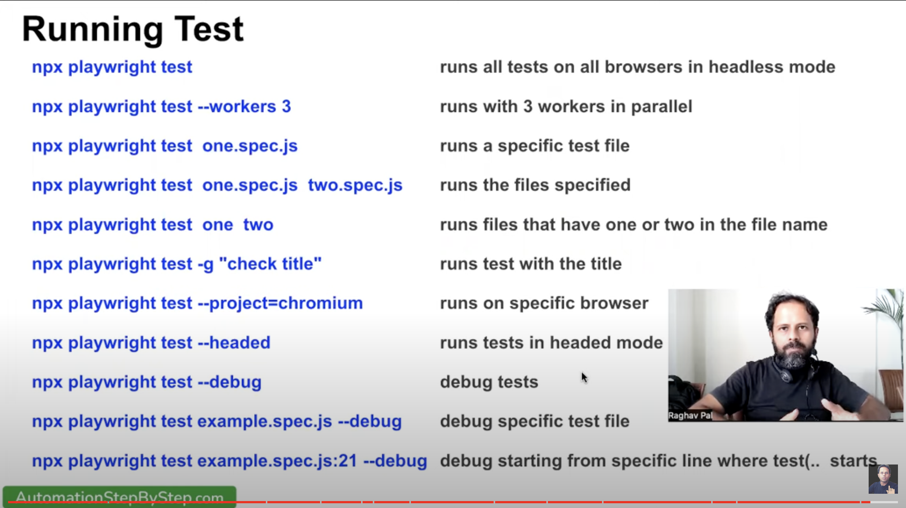
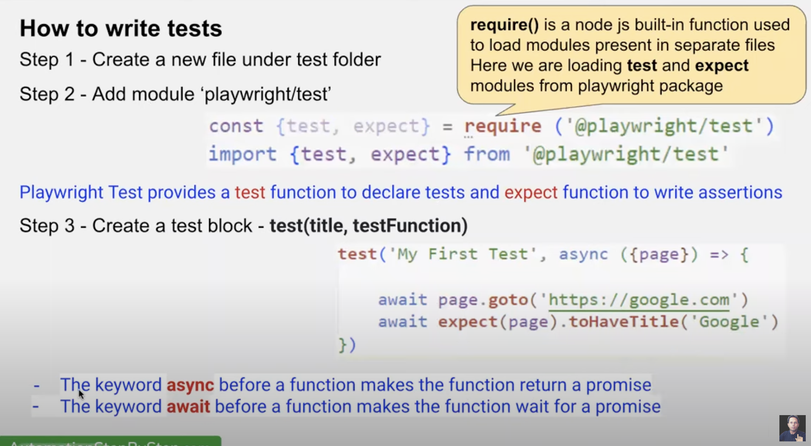
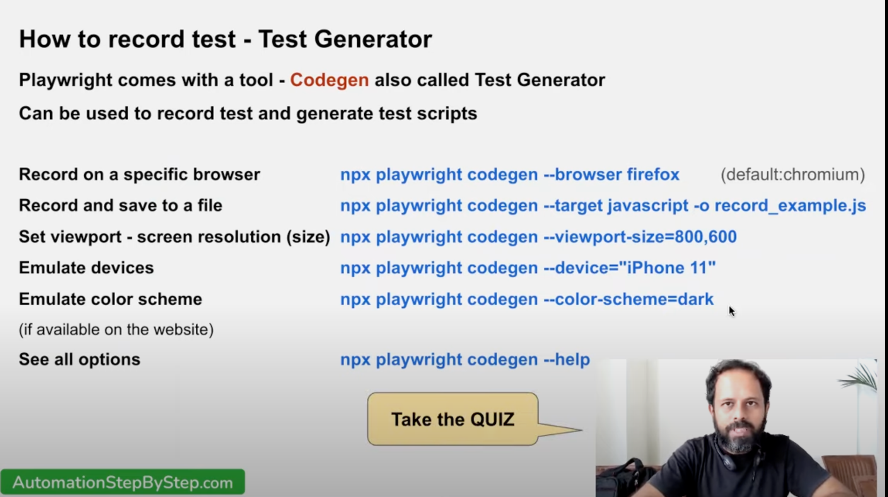
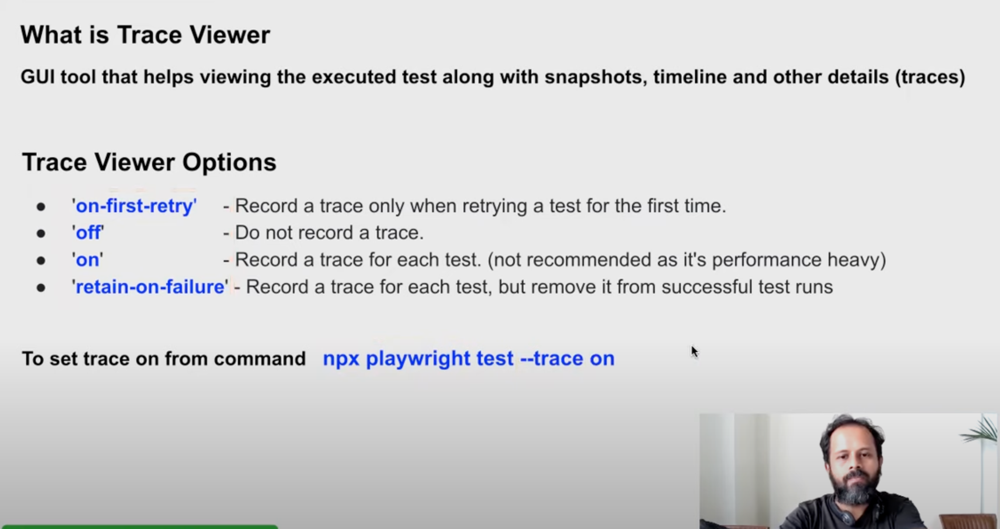
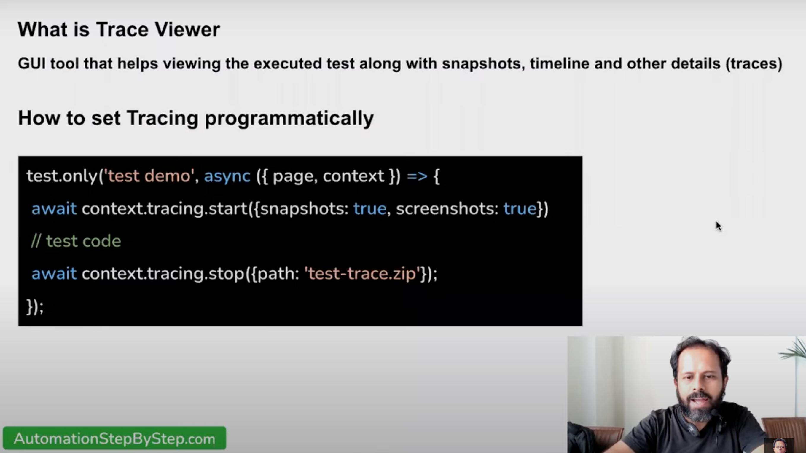

# playwright_tests

###### for [UKTVPLAY] website (http://uktvplay.co.uk)

Inside that directory, you can run several commands:

```Java
npx playwright test // Start a test
npx playwright test example // Runs the tests in a specific file.
npx playwright codegen // Auto generate tests with Codegen
```

#### How to specify to run tests in other direcoties

```Java
- ./tests/example.spec.js // Example end-to-end test
- ./tests-examples/demo-todo-app.spec.js // Demo Todo App end-to-end tests
- ./playwright.config.js // Playwright Test configuration
```

Visit https://playwright.dev/docs/intro for more information. ✨

    Happy hacking! 🎭

### Terminal Commands

```Javascript
npm playwright -v
npx playwright --help
npx playwright show-report
npx playwright test --workers 3
npx playwright test -g "has title"
npx playwright test --project=chromium
npx playwright test --debug
npx playwright test --headed

npx playwright test example
npx playwright test example.spec.js:23

```






### CodeGen

    npx playwright codegen --help
    npx playwright codegen

```
npx playwright test sauce.spec.js --project=chromium --headed
npx playwright test google.com
npx playwright codegen --browser firefox
npx playwright codegen --target javascript -o ./tests/autorec.spec.js
npx playwright codegen --viewport-size=800,600
npx playwright codegen --device="iPhone 11"
npx playwright codegen --color-scheme=light --device="iPhone 11" playwright.dev
npx playwright codegen --color-scheme=dark --device="iPhone 11" playwright.dev
```

### View-race

```
npx playwright show-trace ./test-results/sauce-saucedemo-chromium-retry1/trace.zip
npx playwright show-trace trace.zip
`Using HTML Report`
Using utility - http:/>trace.playwright.dev
```


